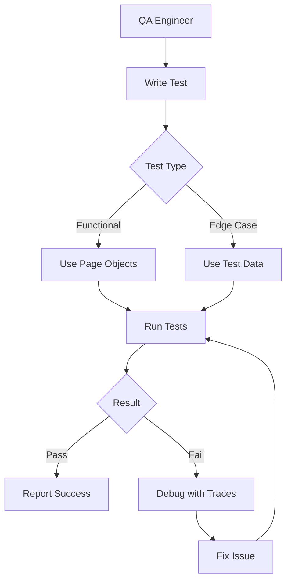
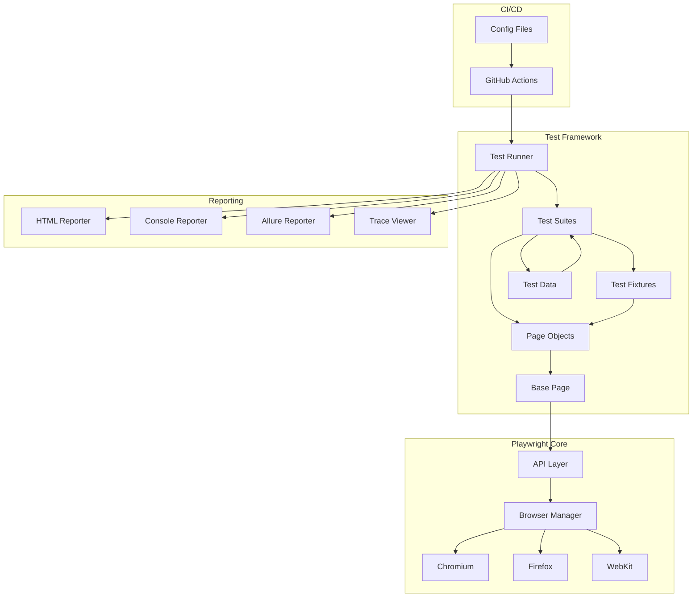
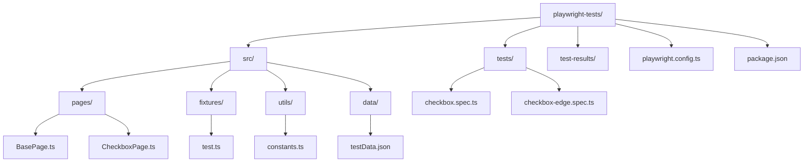
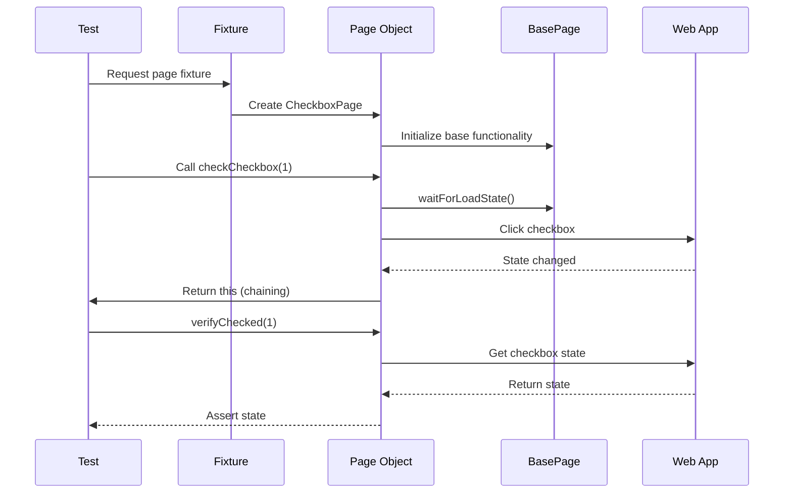
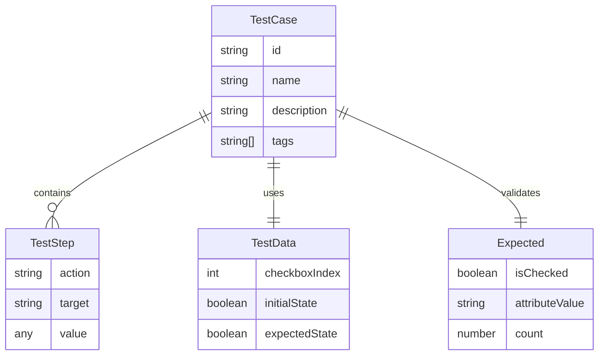
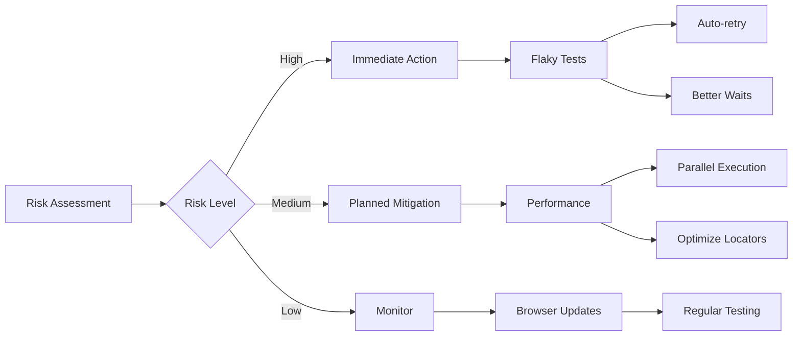
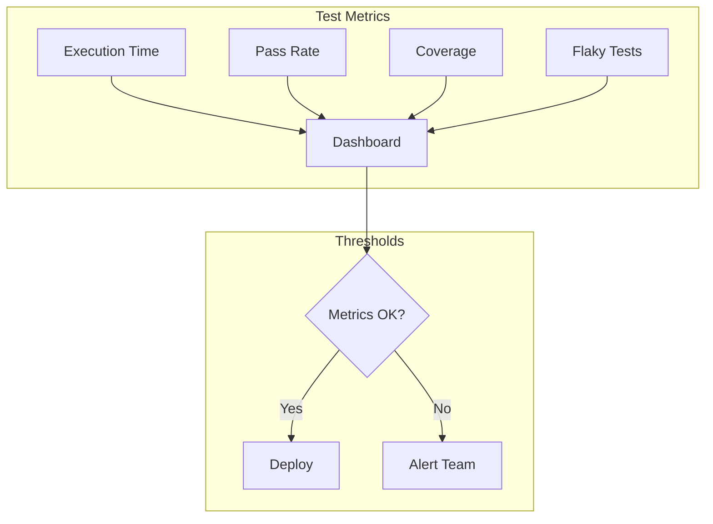

# Playwright Test Automation Framework - Product Requirements Document

**Version**: 1.0  
**Date**: 2025-08-26  
**Status**: Draft

## 1. Executive Summary

This PRD outlines the development of a modern, maintainable test automation framework using Playwright and TypeScript for testing the-internet.herokuapp.com web application. The framework will initially focus on checkbox functionality testing while being architected for future expansion to cover all application features. The solution emphasizes reliability, maintainability, and ease of use through Page Object Model design patterns and TypeScript's type safety.

## 2. Problem & Solution

### 2.1 Problem Statement

Manual testing of web applications is time-consuming, error-prone, and doesn't scale with rapid development cycles. Teams lack a standardized, maintainable approach to E2E testing that can:
- Provide consistent test structure across team members
- Handle UI changes gracefully without breaking tests
- Deliver reliable, fast feedback on application functionality
- Support cross-browser testing requirements

### 2.2 Solution Overview

A Playwright-based test automation framework with:
- **Page Object Model** architecture for maintainability
- **TypeScript** for type safety and better IDE support
- **Cross-browser** testing capabilities
- **Data-driven** test approach for scalability
- **CI/CD ready** configuration for continuous testing

## 3. User Stories

### 3.1 Epic: Test Framework Foundation



#### Story 1: Framework Setup
**As a** QA Engineer  
**I want** a pre-configured Playwright TypeScript project  
**So that** I can start writing tests immediately without setup overhead

**Acceptance Criteria:**
- [ ] TypeScript configuration optimized for Playwright
- [ ] ESLint and Prettier configured
- [ ] Basic project structure created
- [ ] npm scripts for common operations
- [ ] README with setup instructions

**Technical Notes:**
- Use Playwright's built-in TypeScript support
- Configure `tsconfig.json` for strict type checking
- Include path aliases for cleaner imports

#### Story 2: Page Object Implementation
**As a** Test Developer  
**I want** reusable page objects  
**So that** UI changes only require updates in one location

**Acceptance Criteria:**
- [ ] Base page class with common methods
- [ ] CheckboxPage class for checkbox functionality
- [ ] Chainable methods for fluent API
- [ ] Type-safe element locators
- [ ] Auto-waiting built into methods

**Technical Notes:**
- Implement abstract `BasePage` class
- Use TypeScript generics for type safety
- Return `this` for method chaining

#### Story 3: Checkbox Test Suite
**As a** QA Engineer  
**I want** comprehensive checkbox functionality tests  
**So that** I can verify all checkbox behaviors work correctly

**Acceptance Criteria:**
- [ ] Test initial checkbox states
- [ ] Test clicking to check/uncheck
- [ ] Test keyboard interactions
- [ ] Test multiple checkbox operations
- [ ] Verify attribute synchronization
- [ ] Handle edge cases

**Technical Notes:**
- Use `test.describe` blocks for organization
- Implement `beforeEach` for setup
- Include both positive and negative tests

## 4. Technical Architecture

### 4.1 System Architecture



### 4.2 Project Structure



### 4.3 Component Interactions



## 5. API Specifications

### 5.1 Page Object API

```typescript
// BasePage Abstract Class
abstract class BasePage {
    protected page: Page;
    
    constructor(page: Page) {
        this.page = page;
    }
    
    async navigate(url: string): Promise<void> {
        await this.page.goto(url);
        await this.page.waitForLoadState('networkidle');
    }
    
    async getTitle(): Promise<string> {
        return await this.page.title();
    }
}

// CheckboxPage Implementation
class CheckboxPage extends BasePage {
    // Locators
    readonly checkboxes: Locator;
    readonly heading: Locator;
    
    constructor(page: Page) {
        super(page);
        this.checkboxes = page.locator('input[type="checkbox"]');
        this.heading = page.locator('h3');
    }
    
    // Actions
    async checkCheckbox(index: number): Promise<CheckboxPage> {
        await this.checkboxes.nth(index).check();
        return this;
    }
    
    async uncheckCheckbox(index: number): Promise<CheckboxPage> {
        await this.checkboxes.nth(index).uncheck();
        return this;
    }
    
    // Verifications
    async isChecked(index: number): Promise<boolean> {
        return await this.checkboxes.nth(index).isChecked();
    }
    
    async getCheckboxCount(): Promise<number> {
        return await this.checkboxes.count();
    }
}
```

### 5.2 Test Fixture API

```typescript
// Custom Test Fixture
type TestFixtures = {
    checkboxPage: CheckboxPage;
};

const test = base.extend<TestFixtures>({
    checkboxPage: async ({ page }, use) => {
        const checkboxPage = new CheckboxPage(page);
        await checkboxPage.navigate(CHECKBOX_URL);
        await use(checkboxPage);
    },
});

// Usage Example
test('verify checkbox interaction', async ({ checkboxPage }) => {
    await checkboxPage
        .checkCheckbox(0)
        .then(page => page.verifyChecked(0));
});
```

## 6. Data Models

### 6.1 Test Data Structure



### 6.2 Configuration Model

```typescript
interface TestConfig {
    baseURL: string;
    timeout: number;
    retries: number;
    workers: number;
    browsers: BrowserType[];
    reporter: ReporterType[];
}

interface BrowserType {
    name: 'chromium' | 'firefox' | 'webkit';
    options?: BrowserOptions;
}

interface ReporterType {
    name: 'html' | 'list' | 'json' | 'allure';
    options?: Record<string, any>;
}
```

## 7. Implementation Phases

### Phase 1: Foundation (MVP)

```mermaid
gantt
    title Implementation Roadmap
    dateFormat X
    axisFormat %s
    
    section Phase 1
    Project Setup           :1, 2
    Base Architecture       :2, 3
    Checkbox Page Object    :3, 2
    Basic Tests            :4, 2
    Documentation          :5, 1
```


**Deliverables:**
- ✅ Playwright TypeScript project structure
- ✅ BasePage abstract class
- ✅ CheckboxPage implementation
- ✅ 5-10 checkbox tests
- ✅ Basic README documentation

### Phase 2: Enhancement
**Deliverables:**
- Custom test fixtures
- Data-driven test support
- Enhanced error handling
- Detailed test reporting
- CI/CD pipeline setup

### Phase 3: Expansion
**Deliverables:**
- Additional page objects (5-10 pages)
- API testing integration
- Visual regression testing
- Performance metrics
- Test data management system

### Phase 4: Optimization
**Deliverables:**
- Parallel execution optimization
- Test suite organization
- Custom reporter implementation
- Dashboard for test results
- Integration with test management tools

## 8. Risks & Mitigations

| Risk | Impact | Probability | Mitigation |
|------|--------|-------------|------------|
| **Flaky Tests** | High | Medium | Implement proper waits, retry logic, and test isolation |
| **Maintenance Overhead** | Medium | Low | Use Page Object Model, maintain clear documentation |
| **Browser Compatibility** | Medium | Low | Regular cross-browser testing, use Playwright's built-in features |
| **Slow Test Execution** | Medium | Medium | Parallel execution, optimize selectors, minimize waits |
| **Team Adoption** | High | Low | Provide training, clear documentation, pair programming |

### 8.1 Technical Risks



## 9. Success Metrics

### 9.1 Quantitative Metrics
- **Test Execution Time**: < 5 minutes for full suite
- **Test Success Rate**: > 98% (no flaky tests)
- **Code Coverage**: 100% of checkbox functionality
- **Setup Time**: < 30 minutes for new environment
- **Onboarding Time**: < 1 day for new team member

### 9.2 Qualitative Metrics
- **Maintainability**: Changes require updates in single location
- **Readability**: Tests readable by non-technical stakeholders
- **Extensibility**: New features added without refactoring
- **Reliability**: Consistent results across environments
- **Developer Satisfaction**: Positive feedback from team

### 9.3 Metrics Dashboard



## 10. Appendices

### Appendix A: Technology Stack
- **Playwright**: v1.40+
- **TypeScript**: v5.0+
- **Node.js**: v18+ LTS
- **ESLint**: v8+
- **Prettier**: v3+
- **Allure**: v2+ (optional)

### Appendix B: Resources
- [Playwright Documentation](https://playwright.dev)
- [TypeScript Handbook](https://www.typescriptlang.org/docs/)
- [The Internet App](http://the-internet.herokuapp.com/)
- [Page Object Model Pattern](https://martinfowler.com/bliki/PageObject.html)

### Appendix C: Checkbox Behavior Specifications
Based on analysis of the application source:
- Two checkboxes present on page
- Checkbox 1: Initially unchecked
- Checkbox 2: Initially checked  
- Custom JavaScript synchronizes checked attribute with property
- No label elements - text is not clickable
- Form submission available but not required for testing

### Appendix D: Command Reference
```bash
# Installation
npm init playwright@latest
npm install --save-dev @playwright/test typescript

# Execution
npm test                    # Run all tests
npm run test:chrome        # Chrome only
npm run test:debug         # Debug mode
npm run test:headed        # Show browser

# Maintenance
npx playwright codegen      # Generate code
npx playwright show-report  # View HTML report
npx playwright trace       # View trace
```

---

**Document Status**: Ready for Review  
**Next Steps**: Review with stakeholders → Create implementation PRP → Begin Phase 1 development

*Generated with comprehensive research and best practices for 2025*
